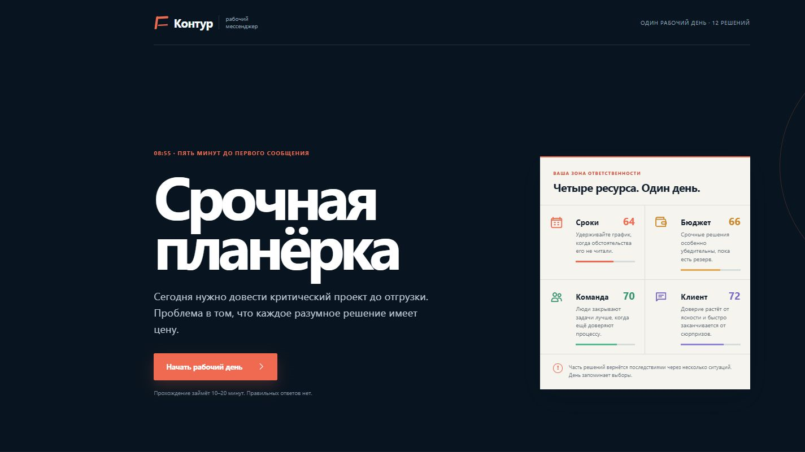
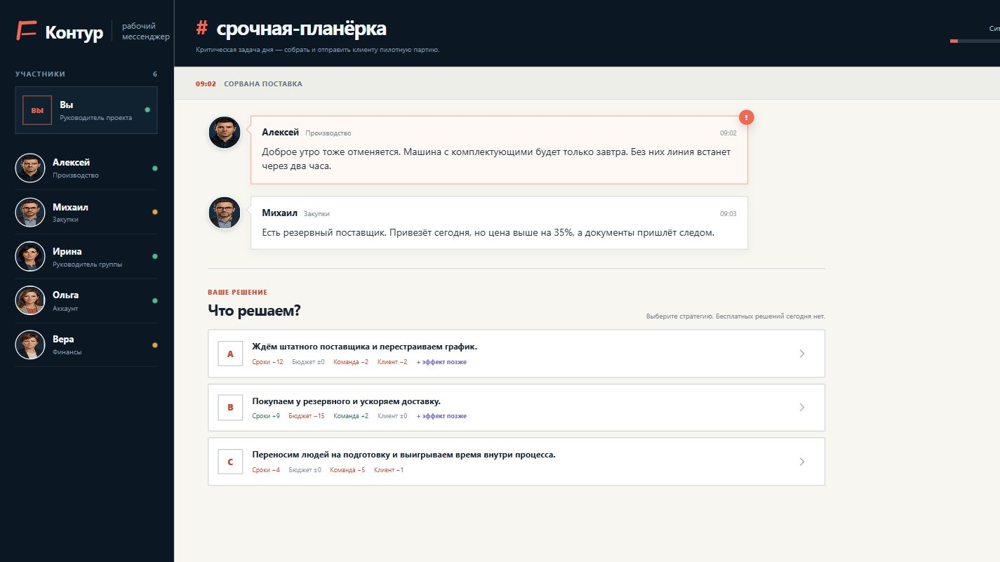
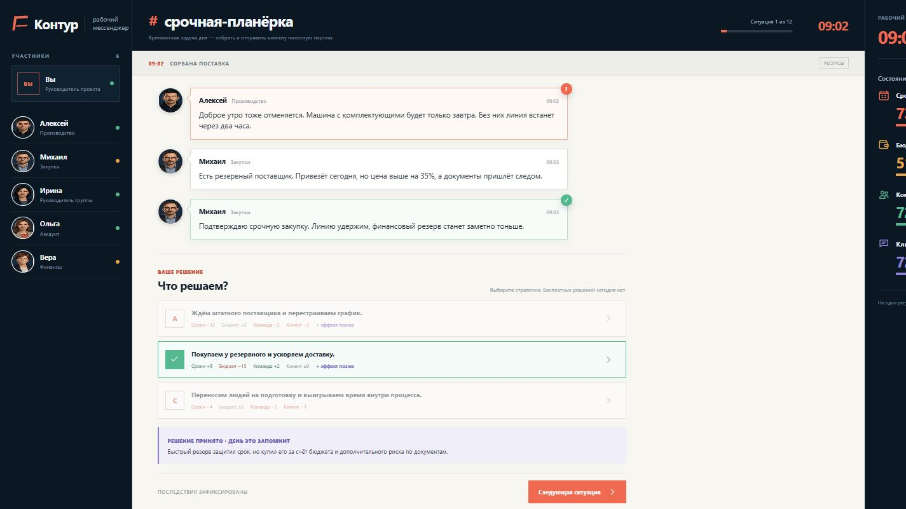
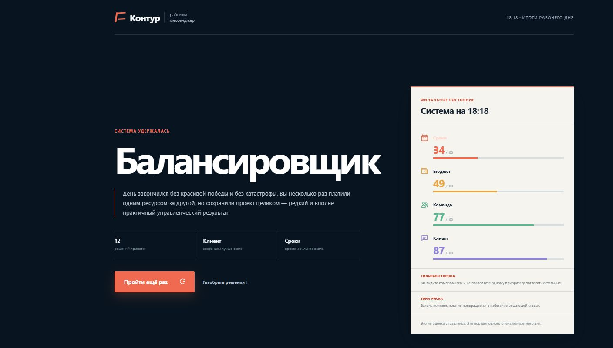
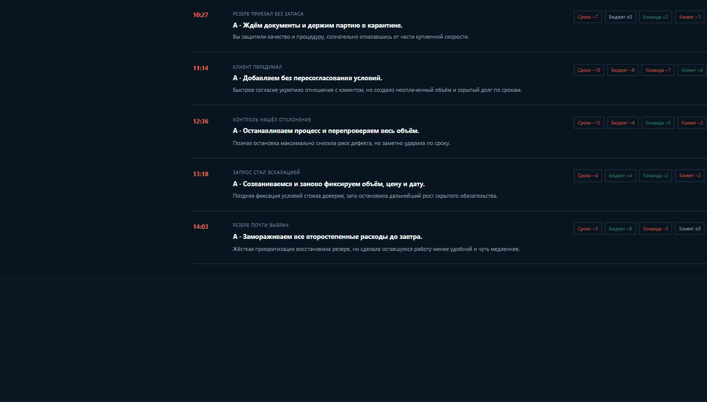
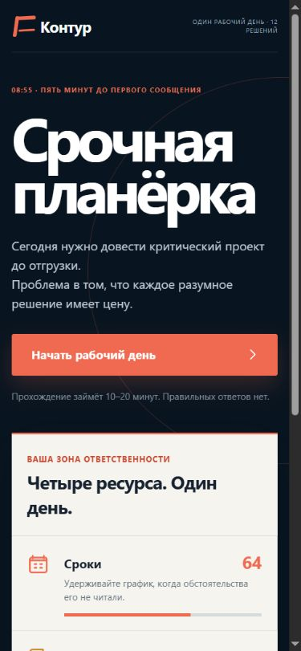
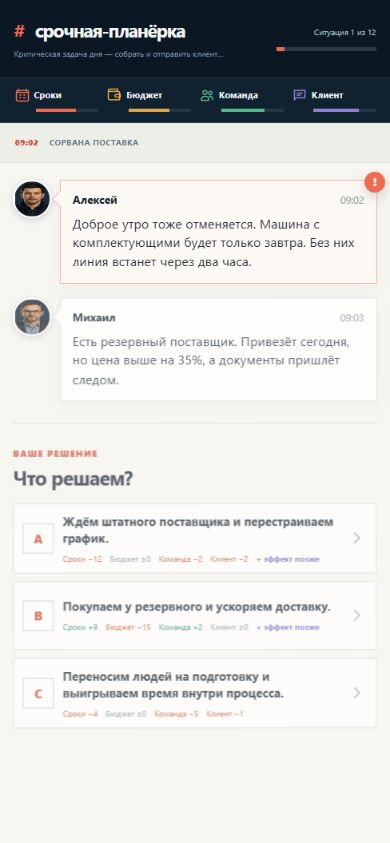

# «Срочная планёрка»: предложения по игровому процессу и UI/UX

Статус: бэклог реализован в версии 1.1  
Дата: 11 августа 2026  
Объём проверки: старт → 12 решений → итог → разбор прохождения; отдельно проверен мобильный viewport 390×844 и геометрия на ширине 320 px.

## Короткий вывод

У игры уже есть сильный каркас: понятная метафора рабочего мессенджера, 12 решений за один день, четыре конкурирующих ресурса, отложенные последствия, ветки и несколько финальных профилей. Основной риск сейчас не в количестве контента, а в том, как игрок читает систему:

1. На десктопе точные числовые эффекты раскрывают математику до выбора и со временем превращают решения в оптимизацию шкал.
2. Предыдущие решения меняют сообщения и отдельные события, но игроку трудно увидеть причинную связь и почувствовать, что маршрут действительно его.
3. На мобильном экране обязательный контент помещается, но четыре ресурса и эффекты решений сжимаются до подписей 8–9 px — это ниже комфортной и доступной читаемости.
4. Итог хорошо описывает стиль управления, но длинный разбор не выделяет 2–3 решения, которые действительно собрали финал.

Рекомендуемый фокус следующей версии: сначала повысить мобильную читаемость и целостность правил, затем усилить причинность и неопределённость, и только после этого добавлять мета-режимы и новый контент.

## Статус реализации версии 1.1

Весь бэклог ниже реализован и проверен сквозным прохождением:

- **P0:** мобильный HUD 2×2 и читаемые эффекты; аварийное состояние при нуле ресурса; управляемый фокус и отдельный live-region; объяснимые условно недоступные ответы.
- **P1:** режимы «Обучение» и «Симуляция»; подпись источника отложенного эффекта; пять условных ответов; трекер сюжетных линий; поворотные решения в финале; видимое автосохранение и продолжение партии.
- **P2:** три испытания; доверие пяти персонажей; отключаемый и приостанавливаемый таймер в трёх кризисах; детерминированные микро-варианты реплик.

Дополнительно итоговый разбор получил фильтры и раздельное отображение немедленных и отложенных изменений. Сохранения переведены на формат `v3` с автоматической миграцией `v2`.

## 1. Рамки аудита

### Цель игрока

Довести критический проект до отгрузки, не обнулив сроки, бюджет, состояние команды или доверие клиента, и получить понятный портрет собственной управленческой стратегии.

### Цель по доступности

Основной маршрут должен быть проходим с клавиатуры, корректно перестраиваться от 320 px, не терять смысл без цветового восприятия и сообщать динамические изменения так, чтобы интерфейс оставался понятным для скринридера.

### Что уже работает хорошо

- Контекст и ставки понятны с первого экрана, а обещание «правильных ответов нет» задаёт верный тон.
- В каждой ситуации есть три правдоподобных решения без очевидно шуточного или заведомо неверного варианта.
- Четыре ресурса создают читаемые компромиссы.
- Реакции персонажей и отложенные последствия поддерживают иллюзию живого рабочего дня.
- Финал не оценивает игрока как «хорошего» или «плохого» руководителя, а описывает стиль и риск.
- В коде уже есть семантические кнопки, `progressbar`, заметный `focus-visible` и обработка `prefers-reduced-motion`.

## 2. Доказательная база: проверенный маршрут

### Шаг 1. Старт — состояние хорошее

Сильная типографическая иерархия, понятный CTA и краткое объяснение четырёх ресурсов. Риск: карточка ресурсов сразу показывает много текста, хотя до первого решения игроку достаточно понять сам принцип компромисса.

### Шаг 2. Первое решение — состояние среднее

Контекст, сообщения и варианты ответа хорошо разделены. Основная проблема — точные дельты раскрывают последствия до выбора. После нескольких ситуаций игрок начинает сравнивать `+9/−15`, а не управленческие стратегии.

### Шаг 3. Реакция и последствия — состояние среднее

Выбранный вариант и изменение шкал заметны. При этом маркер «+ эффект позже» не объясняет, когда именно и из какого решения вернётся последствие; в будущей ситуации эта связь может потеряться.

### Шаг 4. Итог — состояние хорошее

Финальный профиль, четыре шкалы и сильная/слабая сторона собираются в понятный результат. Ссылка на разбор визуально слабее, чем повторное прохождение, хотя именно разбор объясняет ценность симуляции.

### Шаг 5. Полный разбор — состояние среднее

История полная, но 12 одинаково оформленных записей создают длинную ленту без приоритетов. Игроку трудно быстро ответить на вопрос: «Какие три решения больше всего повлияли на мой финал?»

### Шаг 6. Мобильный маршрут — состояние среднее

При ширине 390 px все четыре ресурса, сообщения и варианты ответа остаются в границах экрана. Главный риск — чрезмерное сжатие: подписи эффектов имеют кегль 8 px, названия ресурсов — 9 px, а четыре шкалы конкурируют за одну строку. Маршрут проходим, но требует напряжённого чтения.

## 3. Приоритизированный бэклог

Оценка размера относительная: `S` — локальная доработка, `M` — несколько связанных компонентов или правил, `L` — новая системная механика и дополнительный контент.

| Приоритет | Доработка | Что изменить | Эффект для игрока | Размер |
|---|---|---|---|---|
| P0 | Повысить мобильную читаемость | HUD перестроить в сетку 2×2 или две компактные строки; поднять подписи эффектов с 8 px до 11–12 px; сохранить переносы текстов внутри карточек | Игра не требует напряжённого чтения на телефоне | M |
| P0 | Ввести кризисное состояние при нуле ресурса | Если шкала достигает 0, запускать аварийную ситуацию или досрочный итог, а не продолжать обычный маршрут | Правило «не довести до нуля» становится настоящим, а не декоративным | M |
| P0 | Настроить фокус и live-region | После появления решения переводить фокус или давать быстрый переход к блоку выбора; после ответа — к карточке последствия/кнопке продолжения; не озвучивать заново всю ленту | Клавиатурный и скринридерный маршрут становится предсказуемым | M |
| P0 | Сделать недоступные ответы объяснимыми | Не прятать причину внутри нативно `disabled`-кнопки; использовать `aria-disabled`, связанное описание и видимый маркер блокировки | Игрок понимает, какое прежнее решение закрыло вариант | S |
| P1 | Добавить два режима прозрачности | «Обучение» показывает точные числа; «Симуляция» показывает направление и силу влияния: `сильно ухудшит`, `слегка улучшит`, `неясный отложенный риск` | Возвращает выбору неопределённость без потери обучающей ценности | M |
| P1 | Связать отложенное последствие с источником | В новом сообщении показывать «Последствие решения 09:02» и короткое название исходного выбора; в разборе объединять немедленный и отложенный эффект | Игрок видит причинность и доверяет системе | M |
| P1 | Увеличить число реально условных вариантов | Сейчас `availableWhen` используется только у одного ответа. Сделать 25–35% решений зависимыми от флагов, состояния ресурсов или предыдущих договорённостей | Предыдущие решения начинают менять не только текст, но и доступные действия | L |
| P1 | Показать активные сюжетные линии | Добавить компактные статусы «Поставка», «Качество», «Команда», «Клиент» и подсветку линии текущей ситуации | Ветки и накопленный управленческий долг становятся видимыми | M |
| P1 | Выделить ключевые решения в финале | Перед полной лентой показать три поворотных решения: самый большой риск, самое сильное восстановление, решение, определившее профиль | Итог быстрее объясняет, почему получился именно этот финал | M |
| P1 | Сделать автосохранение видимым | После решения ненавязчиво показывать «Прогресс сохранён локально»; на старте при наличии сессии — отдельные «Продолжить» и «Начать заново» | Повышает доверие и снимает страх потерять длинное прохождение | S |
| P2 | Добавить испытания на повторное прохождение | Примеры: «не опустить ни один ресурс ниже 45», «без переработок», «без незапланированных расходов» | Даёт понятную цель для второго и третьего запуска | M |
| P2 | Ввести лёгкую систему доверия персонажей | 2–3 скрытых или полуоткрытых отношения влияют на тон реплик, скорость реакции и доступность помощи | Персонажи становятся механикой, а не только голосами шкал | L |
| P2 | Добавить ограниченный таймер только в кризисах | Таймер использовать в 2–3 ситуациях, с возможностью отключения/паузы и без наказания в доступном режиме | Усиливает ощущение срочности, не превращая весь текст в гонку | M |
| P2 | Добавить вариативные микро-события | На 2–3 этапах выбирать одну из двух коротких реплик/осложнений, не меняя длину дня | Снижает предсказуемость повторных прохождений | L |

## 4. Доработки игрового процесса подробнее

### 4.1. Разделить «обучение» и «симуляцию»

Точные числа полезны при первом знакомстве, но уменьшают драматургию. Оптимальный компромисс — не удалять их, а сделать частью режима:

- **Обучение:** текущие точные дельты, объяснение четырёх ресурсов и развёрнутые последствия.
- **Симуляция:** качественные сигналы до выбора, точные числа только после решения и в финальном разборе.
- Выбор режима размещается на старте и сохраняется локально.

Критерий готовности: игрок может пройти один и тот же сценарий в обоих режимах; логика эффектов идентична, меняется только объём раскрытой информации.

### 4.2. Сделать причинность явной

Сейчас у отложенного эффекта есть общий ярлык «+ эффект позже». Стоит сохранить интригу, но дать системе память:

- до выбора: «есть отложенный риск» без точной цифры;
- в момент срабатывания: «Возвращается решение 09:02 — срочная закупка»;
- в итоговом разборе: немедленный эффект, отложенный эффект и связанные сообщения в одной записи;
- при наведении или фокусе: короткое пояснение, через сколько ситуаций эффект вернулся.

Критерий готовности: для каждого `DelayedConsequence` игрок может однозначно определить исходное решение.

### 4.3. Усилить ветвление без разрастания дерева

В текущей модели 15 событий образуют 12 этапов, а ветки расположены на этапах 3, 6 и 10. Это хорошая архитектура, но вариативность нужно проявить сильнее:

- каждую ветку сопровождать заметным изменением темы/участника/доступных ответов;
- использовать флаги не только для выбора события, но и для открытия и закрытия решений;
- после схождения веток возвращать конкретный след: сообщение, задолженность, поддержку персонажа;
- добавить в финал 1–2 предложения о том, какой маршрут прошёл игрок.

Целевой ориентир: не менее 4–6 из 12 ситуаций должны содержать хотя бы один вариант, доступность или формулировка которого зависит от предыдущих решений.

### 4.4. Сделать ноль настоящим поражением или кризисом

Сейчас шкалы ограничиваются диапазоном 0–100, но обычный маршрут может продолжаться после критического значения. Предлагается двухступенчатая модель:

- `1–10`: критическое состояние, меняется оформление шкалы и добавляется предупреждение;
- `0`: специальное событие — остановка проекта, бюджетная блокировка, распад команды или потеря клиента;
- игрок получает один аварийный выбор, позволяющий либо частично восстановиться большой ценой, либо принять досрочный финал.

Так сохраняется драматургия и появляется шанс на управленческое спасение, но правило перестаёт быть формальным.

### 4.5. Углубить итог, не удлиняя его

Перед полной историей показать компактный блок:

1. **Поворот дня** — решение с наибольшим суммарным немедленным и отложенным влиянием.
2. **Цена стратегии** — ресурс, которым игрок чаще всего платил.
3. **Нереализованная альтернатива** — один доступный тогда вариант и его качественный контраст, без объявления «правильного ответа».

Полную ленту оставить ниже, но добавить фильтры «все», «отложенные», «ключевые» и сюжетные линии.

## 5. Доработки UI/UX подробнее

### 5.1. Мобильная компоновка

Рекомендуемый порядок экрана на ширине до 600 px:

1. компактный заголовок канала и прогресс;
2. HUD 2×2 без горизонтального скролла;
3. маркер ситуации;
4. сообщения;
5. блок выбора в нормальном потоке страницы.

Технические критерии приёмки:

- на 320, 360, 390, 430 и 768 px нет горизонтального обрезания и скрытого обязательного контента;
- все четыре ресурса видны без свайпа;
- основной текст не меньше 14 px, служебный — не меньше 11–12 px;
- подписи эффектов переносятся на следующую строку и не уменьшаются до 8 px;
- интерактивные цели не меньше 44×44 px;
- при 200% zoom основной маршрут остаётся проходимым.

### 5.2. Иерархия игрового экрана

- На широком десктопе можно увеличить полезную ширину ленты с текущих примерно 770 px до 840–920 px или использовать часть свободного пространства под компактную панель активных линий.
- После принятия решения выбранную карточку стоит сворачивать в сообщение игрока, а не оставлять рядом две неактивные альтернативы. Это уменьшит визуальный шум и приблизит механику к метафоре чата.
- Кнопку продолжения лучше держать в видимой области после появления последней реакции; на мобильном — как нижний sticky-action только внутри игрового экрана.
- Прогресс «ситуация N из 12» дополнить временем дня и маркерами ключевых этапов, не раскрывая будущие события.

### 5.3. Состояния и обратная связь

- У выбранного решения отделять **немедленный результат** от **риска позже**.
- Критические шкалы маркировать текстом и иконкой, не только цветом.
- Для недоступного решения показывать причину в интерфейсе: «Закрыто: ранее вы не подготовили частичную отгрузку».
- Добавить ненавязчивый статус сохранения без тоста, перекрывающего сообщения.
- На старте при найденном прогрессе не подменять основной CTA молча: явно показать время и номер сохранённой ситуации.

### 5.4. Доступность

Подтверждённые сильные стороны: есть клавиатурный `focus-visible`, семантические кнопки, `progressbar`, числовые знаки `+ / −` дополняют цвет, учтён `prefers-reduced-motion`.

Риски, требующие отдельной проверки NVDA/VoiceOver:

- `aria-live="polite"` стоит на всей ленте сообщений, поэтому обновление может повторно озвучивать уже прочитанный контент;
- после анимированного появления блока решения фокус остаётся в предыдущем месте;
- нативно `disabled`-вариант нельзя сфокусировать, поэтому его объяснение может быть недоступно клавиатуре и скринридеру;
- несколько служебных подписей на мобильном имеют слишком маленький кегль;
- анимационные задержки должны сокращаться не только визуально, но и логически при `prefers-reduced-motion`.

## 6. Рекомендуемая последовательность релизов

### Версия 1.1 — мобильная читаемость и ясность правил

- мобильный HUD и читаемый кегль;
- HUD 2×2;
- минимальный читаемый кегль;
- фокус/live-region;
- объяснимые недоступные ответы;
- кризис при 0;
- индикатор автосохранения.

### Версия 1.2 — глубина решений

- режимы «Обучение» и «Симуляция»;
- привязка отложенных последствий к исходным решениям;
- 4–6 ситуаций с условными действиями;
- видимые сюжетные линии;
- три ключевых решения в финале.

### Версия 1.3 — реиграбельность

- испытания;
- лёгкая система доверия персонажей;
- вариативные микро-события;
- ограниченный доступный таймер в отдельных кризисах.

## 7. Как измерить эффект

Если в проект будет добавлена анонимная продуктовая аналитика, полезны следующие показатели:

- доля стартовавших, дошедших до 3-й, 6-й и 12-й ситуации;
- медианное время выбора по ситуациям;
- доля повторных прохождений;
- распределение финалов и выборов — отсутствие доминирующего «математически лучшего» маршрута;
- доля игроков, открывших разбор и просмотревших ключевые решения;
- частота критических состояний и аварийного восстановления;
- различие завершения между десктопом и мобильными устройствами.

Аналитика не должна содержать тексты, персональные данные или содержимое браузерного хранилища; достаточно идентификаторов событий, вариантов и агрегированных шкал.

## 8. Ограничения аудита

- Проверен один полный маршрут, мобильный экран 390×844 и геометрия на ширине 320 px; это не заменяет матрицу устройств.
- Проведена структурная проверка доступности по интерфейсу и коду, но не полноценный аудит с NVDA, VoiceOver и 200% zoom.
- Баланс оценён по текущей модели и одному прохождению; перед точной перенастройкой чисел нужен автоматический прогон всех достижимых маршрутов и распределений финалов.

## 9. Definition of Done для следующей полноценной версии

- Игра проходит без горизонтального обрезания на ширине от 320 px.
- Все четыре ресурса и причины недоступных действий доступны визуально и программно.
- Ноль любого ресурса вызывает явное игровое последствие.
- Каждый отложенный эффект связан с исходным решением в ленте и финальном разборе.
- Игрок может выбрать прозрачный обучающий или менее предсказуемый симуляционный режим.
- Не менее 4 ситуаций ощутимо меняются из-за предыдущих решений.
- Итог объясняет профиль через три конкретных поворотных решения.
- Полный маршрут проверен мышью, клавиатурой, на 320/390/768/1440 px и со скринридером хотя бы в одном браузере.
